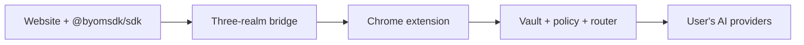

# Bring Your Model

[](https://github.com/indrasishbanerjee/BringYourModel/actions/workflows/ci.yml)
[](https://www.npmjs.com/package/@byomsdk/sdk)
[](LICENSE)

**Your AI keys. Your models. Your rules — on every website.**

[Bring Your Model](https://bringyourmodel.com) is an open-source **AI wallet for Chrome**: users connect their own providers (OpenAI, Anthropic, Google, Ollama, LM Studio, and more), and websites call AI through a small SDK — without ever touching API keys.

| Try it | Install extension | npm packages |
|--------|-------------------|--------------|
| [Live demo](https://bringyourmodel.com/demo/) | [Chrome Web Store](https://chromewebstore.google.com/detail/byom-wallet/jnpajlpoemfgehchogeboncaikdoggdd) | [`@byomsdk/sdk`](https://www.npmjs.com/package/@byomsdk/sdk) · [`@byomsdk/react`](https://www.npmjs.com/package/@byomsdk/react) |

---

## Who it's for

### Local-first users

Run **Ollama** or **LM Studio** on your machine, add the provider in BYOM Wallet, and use your local models on compatible websites — no cloud API keys required.

### Web app developers

Add AI features without hosting inference for every visitor. **BYOM users** route through their encrypted vault; everyone else can use your backend via the [fallback helper](docs/fallback-strategy.md).

Think **MetaMask for AI access**: the extension is the trust boundary; the site gets capabilities, not credentials.

---

## How it works



1. **User** installs the extension, unlocks the vault, and adds providers.
2. **Website** loads `@byomsdk/sdk` and requests an AI task.
3. **Extension** validates the origin, checks grants/budgets, shows consent when needed, routes to the right model, and returns the result.
4. **API keys never enter the page** — only approved responses do.

Details: [Architecture](docs/architecture.md) · [Security](docs/security.md) · [Install](docs/install.md)

---

## Quick start

### Users

1. [Install BYOM Wallet](https://chromewebstore.google.com/detail/byom-wallet/jnpajlpoemfgehchogeboncaikdoggdd) from the Chrome Web Store
2. Unlock the vault and add **Ollama** or **LM Studio** (or a hosted provider)
3. Open the [live demo](https://bringyourmodel.com/demo/) and approve the site

### Developers

```bash
npm install @byomsdk/sdk
# optional React wrapper
npm install @byomsdk/react
```

```typescript
import { createByomWithFallback } from '@byomsdk/sdk';

const ai = createByomWithFallback({
  askFallback: async (req, signal) => {
    const res = await fetch('/api/ai/ask', {
      method: 'POST',
      headers: { 'Content-Type': 'application/json' },
      body: JSON.stringify(req),
      signal,
    });
    return res.json();
  },
});

const result = await ai.ask({ input: 'Summarize this page.' });
```

**OpenAI-style migration:**

```typescript
import { OpenAI } from '@byomsdk/sdk/openai';

const client = new OpenAI();
const completion = await client.chat.completions.create({
  model: 'gpt-4o-mini',
  messages: [{ role: 'user', content: 'Hello' }],
});
```

Full API: [SDK API](docs/sdk-api.md) · [Fallback strategy](docs/fallback-strategy.md) · [OpenAI compat](docs/openai-compat.md) · [Prompt API compat](docs/prompt-api-compat.md)

### Contributors

```bash
pnpm install
pnpm dev                    # extension (load packages/extension/.output/chrome-mv3)
pnpm --filter @byom/demo-site dev
pnpm test
```

See [CONTRIBUTING.md](CONTRIBUTING.md).

---

## Packages

| Package | npm | Role |
|---------|-----|------|
| [`packages/sdk`](packages/sdk) | [`@byomsdk/sdk`](https://www.npmjs.com/package/@byomsdk/sdk) **v0.3.0** | Website integration, fallback helpers, OpenAI & Prompt API shims |
| [`packages/react`](packages/react) | [`@byomsdk/react`](https://www.npmjs.com/package/@byomsdk/react) **v0.1.0** | React hooks and install banner |
| [`packages/extension`](packages/extension) | — | Chrome extension (vault, consent, OpenModelRouter) |
| [`packages/shared`](packages/shared) | — | Zod schemas, protocol types (internal) |
| [`packages/demo-site`](packages/demo-site) | — | Local SDK playground ([live demo](https://bringyourmodel.com/demo/)) |

Internal workspace packages use `@byom/*`; published npm packages use `@byomsdk/*`.

---

## Documentation

- [Install](docs/install.md) — extension install
- [Architecture](docs/architecture.md) — three-realm bridge, ports, message flow
- [Security](docs/security.md) — vault, nonce replay, consent
- [SDK API](docs/sdk-api.md) — methods, streaming, errors
- [Fallback strategy](docs/fallback-strategy.md) — progressive enhancement
- [OpenAI compatibility](docs/openai-compat.md) — drop-in OpenAI-style client
- [Prompt API compatibility](docs/prompt-api-compat.md) — LanguageModel shim
- [Protocol](docs/protocol.md) — wire format and versioning
- [Policy DSL](docs/policy-dsl.md) — grants, budgets, model allowlists
- [Roadmap](ROADMAP.md)

---

## License

[Apache License 2.0](LICENSE)
