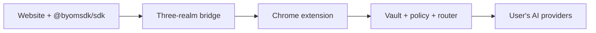

# Bring Your Model

**Your AI keys. Your models. Your rules — on every website.**

[Bring Your Model](https://bringyourmodel.com) is an open-source **AI wallet for Chrome**: users connect their own providers (OpenAI, Anthropic, Google, OpenRouter, Ollama, and more), and websites call AI through a small SDK — without ever touching API keys.

Think **MetaMask for AI access** or **Stripe.js for inference**: the extension is the trust boundary; the site gets capabilities, not credentials.

## Links

| Resource | Link |
|----------|------|
| **Website** | [bringyourmodel.com](https://bringyourmodel.com) |
| **Chrome Extension** | [Install from Chrome Web Store](https://chromewebstore.google.com/detail/jnpajlpoemfgehchogeboncaikdoggdd) |
| **npm SDK** | [@byomsdk/sdk on npm](https://www.npmjs.com/package/@byomsdk/sdk) |

---

## Why BYOM

| Problem today | How BYOM helps |
|---------------|----------------|
| Sites pay for AI or bake keys into backends | Users bring their own plans and keys |
| Users paste API keys into untrusted UIs | Keys stay in an encrypted extension vault |
| No per-site spend or model control | Consent prompts, budgets, grants, and routing policies |
| Every app reinvents provider wiring | One SDK: `byom.ask()`, `byom.stream()`, `byom.embed()`, and more |

**Motto:** *Bring your model. Browse with power. Stay in control.*

---

## How it works



1. **User** installs the extension, unlocks the vault, and adds providers.
2. **Website** loads `@byomsdk/sdk` and requests an AI task.
3. **Extension** validates the origin, checks grants/budgets, shows consent when needed, routes to the right model, and returns the result.
4. **API keys never enter the page** — only approved responses do.

Details: [Architecture](docs/architecture.md) · [Security](docs/security.md)

---

## Who it's for

- **Users** who want one wallet for AI across the web, with spend caps and privacy choices.
- **Developers** who want AI features without hosting inference or holding user API keys.
- **Builders** integrating BYOM into SaaS, copilots, support tools, and in-page assistants.

---

## Packages

| Package | Role |
|---------|------|
| [`packages/extension`](packages/extension) | Chrome extension (OpenModelRouter engine, vault, consent UI) |
| [`packages/sdk`](packages/sdk) | [`@byomsdk/sdk`](https://www.npmjs.com/package/@byomsdk/sdk) — website integration |
| [`packages/shared`](packages/shared) | Zod schemas, protocol types, shared errors |
| [`packages/demo-site`](packages/demo-site) | Local demo app for SDK + extension |
| [`packages/e2e`](packages/e2e) | Playwright end-to-end tests |

---

## Quick start

### Prerequisites

- Node.js 20+
- [pnpm](https://pnpm.io) 9+

### Install and run

```bash
pnpm install

# Terminal 1: extension (load unpacked from packages/extension/.output/chrome-mv3)
pnpm dev

# Terminal 2: demo site
pnpm --filter @byom/demo-site dev
```

Load the built extension from `packages/extension/.output/chrome-mv3` in `chrome://extensions` (Developer mode → Load unpacked).

### Build and test

```bash
pnpm build
pnpm test
pnpm --filter @byom/e2e test

# Chrome Web Store zip
pnpm --filter @byom/extension zip
```

---

## SDK example

```typescript
import { byom } from '@byomsdk/sdk';

if (!(await byom.isAvailable())) {
  throw new Error('Install Bring Your Model to use AI on this site');
}

const result = await byom.ask({
  task: 'summarize',
  input: 'Long text to summarize...',
});

console.log(result.text);
```

**CDN (IIFE):**

```html
<script src="https://cdn.jsdelivr.net/npm/@byomsdk/sdk/dist/byom.iife.min.global.js"></script>
<script>
  byom.ask({ task: 'summarize', input: '...' }).then((r) => console.log(r.text));
</script>
```

Full API: [SDK API](docs/sdk-api.md) · [Policy DSL](docs/policy-dsl.md)

---

## Documentation

- [Architecture](docs/architecture.md) — three-realm bridge, ports, message flow
- [Security](docs/security.md) — vault, nonce replay, prompt shield, consent
- [SDK API](docs/sdk-api.md) — methods, streaming, errors
- [Policy DSL](docs/policy-dsl.md) — grants, budgets, model allowlists

---

## Contributing

Issues and PRs are welcome. Please avoid committing secrets, build artifacts (`dist/`, `.output/`), or local planning notes — they are listed in [`.gitignore`](.gitignore).

---

## License

[Apache License 2.0](LICENSE)
