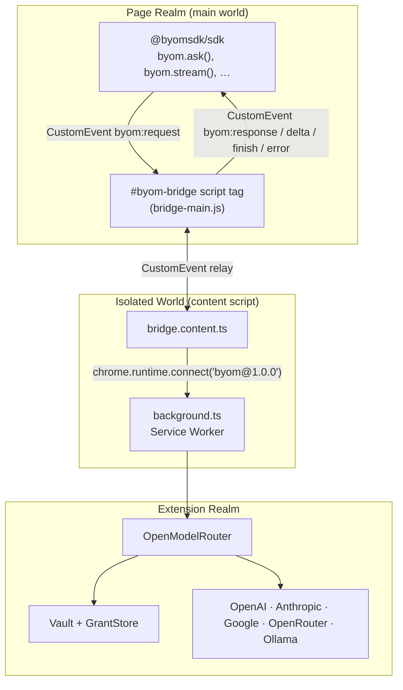
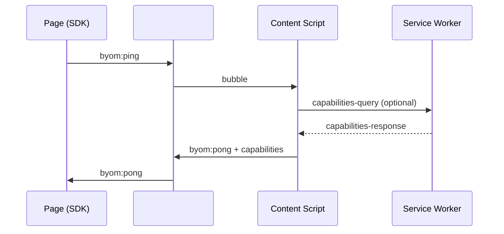
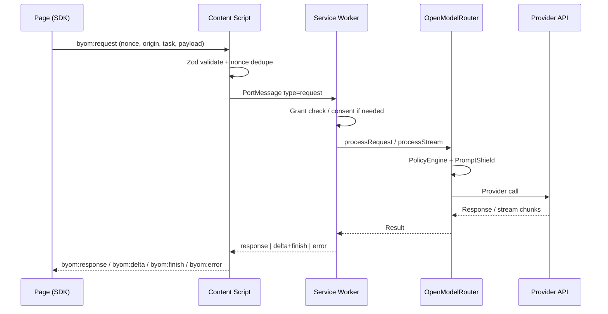

# BYOM Architecture

Bring Your Model (BYOM) is a Chrome extension plus npm SDK that lets websites call the user's own AI providers without handling API keys. The system is organized around a **three-realm bridge** that keeps page JavaScript isolated from extension privileges while still enabling a simple `byom.*` API.

## Three Realms

| Realm | Context | Role |
|-------|---------|------|
| **Page** | Website origin (untrusted) | Runs `@byomsdk/sdk`; dispatches CustomEvents on `#byom-bridge` |
| **Isolated world** | Content script (`bridge.content.ts`) | Validates requests, holds the Chrome port, relays messages |
| **Extension** | Service worker + side panel | Policy, vault, routing, provider calls |



### Why three realms?

1. **Page isolation** — Site code cannot call `chrome.*` APIs or read extension storage.
2. **Main-world relay** — `bridge-main.js` runs in the page's JavaScript realm so the SDK can use normal DOM APIs without a bundler-specific content-script injection.
3. **Content script gate** — Every request is validated (Zod schema, nonce, origin) before it reaches the service worker.

## Message Flow

### Ping / availability check



### Request lifecycle



## Port Lifecycle

Ports connect the content script to the background service worker using a versioned name:

```
byom@1.0.0
```

### Connection handshake

1. Content script calls `chrome.runtime.connect({ name: 'byom@1.0.0' })`.
2. Background validates the port name against `/^byom@(\d+\.\d+\.\d+)$/`.
3. Major protocol version must match (`isProtocolCompatible`).
4. On mismatch, background sends `PROTOCOL_VERSION_MISMATCH` and disconnects.

### Active request tracking

Each port maintains an `activeRequests` set keyed by `reqId`:

| Event | Action |
|-------|--------|
| `request` received | Add `reqId` to set; start heartbeat if first active request |
| `response`, `error`, or `finish` | Remove `reqId`; stop heartbeat when set is empty |
| Port disconnect | Abort all active streams; reject pending consent promises |

### Heartbeat (MV3 service worker keep-alive)

Chrome MV3 service workers suspend after ~30 seconds of inactivity. During long operations (especially streaming):

- Background sends `{ type: 'heartbeat' }` every **25 seconds** while `activeRequests.size > 0`.
- Content script responds with `{ type: 'heartbeat-ack' }`.
- Heartbeat stops automatically when no requests remain.

### Stream abort

The SDK can cancel an in-flight stream:

1. Page sends `{ type: 'abort', reqId }` through the port.
2. Background looks up the `AbortController` in `activeStreams` and calls `.abort()`.
3. Generator in OpenModelRouter stops yielding; port receives an error or early finish.

### Port teardown

On `port.onDisconnect`:

- Heartbeat interval cleared
- All `activeStreams` aborted
- Pending consent dialogs for that origin rejected

## Protocol Summary

| Constant | Value |
|----------|-------|
| Protocol version | `1.0.0` |
| Port name | `byom@1.0.0` |
| Nonce TTL (SW) | 60 seconds |
| Nonce cache (content script) | LRU, 1000 entries |
| Default request timeout (SDK) | 30 seconds |

### Port message types

| Type | Direction | Purpose |
|------|-----------|---------|
| `request` | Page → SW | Start a task |
| `response` | SW → Page | Single-shot result |
| `delta` | SW → Page | Streaming text chunk |
| `finish` | SW → Page | Stream metadata (usage, cost) |
| `error` | SW → Page | Structured error payload |
| `abort` | Page → SW | Cancel streaming request |
| `heartbeat` | SW → CS | Keep SW alive |
| `heartbeat-ack` | CS → SW | Acknowledge heartbeat |
| `event` | SW → Page | Push notification (vault locked, budget warning) |
| `capabilities-query` | CS → SW | Fetch extension capabilities |
| `capabilities-response` | SW → CS | Capabilities payload |

### CustomEvent names (page ↔ content script)

| Event | Purpose |
|-------|---------|
| `byom:ping` / `byom:pong` | Availability probe |
| `byom:request` | Outbound task |
| `byom:response` | Task result |
| `byom:delta` | Stream chunk |
| `byom:finish` | Stream completion |
| `byom:error` | Error |
| `byom:event` | Extension push event |

## Internal Components

### OpenModelRouter

The routing engine inside the extension. Responsibilities:

- Provider registry (rebuilt on vault unlock / provider changes)
- Model alias resolution (`fast`, `reasoning`, `cheap`, `private`)
- Policy enforcement via `PolicyEngine`
- Prompt sanitization via `PromptShield`
- Cost tracking through `GrantStore` (authoritative)

### GrantStore

Per-origin permission documents. See [policy-dsl.md](./policy-dsl.md).

### Dashboard RPC

Extension UI (side panel, options page) communicates with the service worker via `chrome.runtime.sendMessage` using `dashboard:*` RPC kinds — never by accessing stores directly from UI code.

## Key Files

| File | Purpose |
|------|---------|
| `packages/sdk/src/index.ts` | Public `byom` API |
| `packages/sdk/src/bridge.ts` | Page-realm CustomEvent bridge |
| `packages/extension/entrypoints/bridge.content.ts` | Content script port + validation |
| `packages/extension/entrypoints/bridge-main.ts` | Main-world event relay |
| `packages/extension/entrypoints/background.ts` | Port lifecycle, consent, routing |
| `packages/extension/modules/openmodelrouter/` | Provider routing and policy |
| `packages/shared/src/schemas.ts` | Zod schemas shared across packages |

## Related Docs

- [Security model](./security.md)
- [SDK API reference](./sdk-api.md)
- [Policy DSL (Grants)](./policy-dsl.md)
