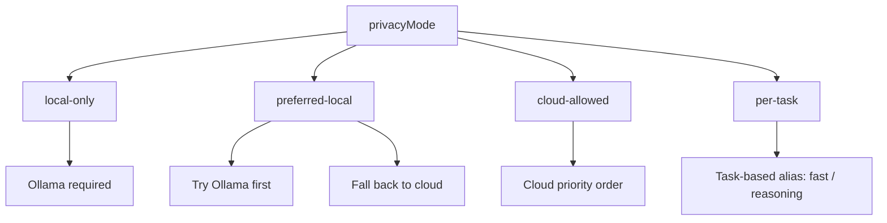
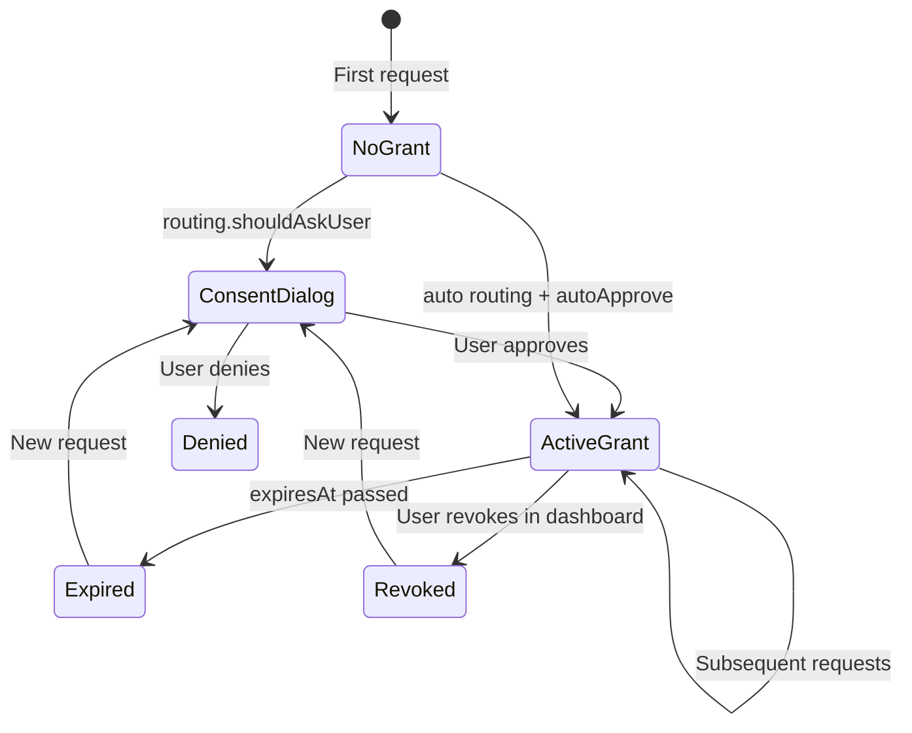

# BYOM Policy DSL

Every approved website receives a **Grant** document that defines what it may do, how much it may spend, and which models/providers it may use. Grants are stored in the extension's `GrantStore` and enforced by `PolicyEngine` before any provider call.

## Grant Schema

```typescript
interface Grant {
  origin: string;                    // e.g. "https://example.com"
  providers: ProviderId[];           // allowed provider kinds
  allowedTasks: TaskType[];            // permitted SDK methods
  modelAllowlist?: string[];         // optional model restrictions
  dailyBudgetUSD: number;            // daily spend cap (≥ 0)
  monthlyBudgetUSD: number;          // monthly spend cap (≥ 0)
  perRequestTokenCap: number;        // max estimated tokens per request (> 0)
  privacyMode: PrivacyMode;          // routing preference
  autoApprove: boolean;              // skip consent on subsequent requests
  expiresAt?: number;                // optional expiry timestamp (ms)
  createdAt: number;
  updatedAt: number;
}
```

Validated by the extension's shared `GrantSchema`.

### Field reference

| Field | Required | Description |
|-------|----------|-------------|
| `origin` | yes | Site origin; must match `window.location.origin` |
| `providers` | yes | Subset of configured providers the site may use |
| `allowedTasks` | yes | Tasks the site may invoke (`ask`, `stream`, `embed`, …) |
| `modelAllowlist` | no | Glob patterns restricting `model` parameter |
| `dailyBudgetUSD` | yes | Hard daily spend limit (authoritative in GrantStore) |
| `monthlyBudgetUSD` | yes | Hard monthly spend limit |
| `perRequestTokenCap` | yes | Preflight token estimate ceiling |
| `privacyMode` | yes | Controls local vs cloud routing |
| `autoApprove` | yes | If true, routing engine may skip consent dialog |
| `expiresAt` | no | Grant invalid after this timestamp |

### Provider IDs

```typescript
type ProviderId = 'openai' | 'anthropic' | 'google' | 'openrouter' | 'ollama';
```

### Task types

```typescript
type TaskType = 'ask' | 'stream' | 'embed' | 'classify' | 'extract' | 'chat';
```

## Example Grants

### Minimal development grant

```json
{
  "origin": "http://localhost:5173",
  "providers": ["openai", "ollama"],
  "allowedTasks": ["ask", "stream", "chat"],
  "dailyBudgetUSD": 5,
  "monthlyBudgetUSD": 50,
  "perRequestTokenCap": 4000,
  "privacyMode": "cloud-allowed",
  "autoApprove": true,
  "createdAt": 1716451200000,
  "updatedAt": 1716451200000
}
```

### Production site with model restrictions

```json
{
  "origin": "https://myapp.com",
  "providers": ["openai", "anthropic"],
  "allowedTasks": ["ask", "stream", "classify", "extract"],
  "modelAllowlist": ["gpt-4o*", "claude-3-5-*"],
  "dailyBudgetUSD": 10,
  "monthlyBudgetUSD": 200,
  "perRequestTokenCap": 8000,
  "privacyMode": "preferred-local",
  "autoApprove": false,
  "expiresAt": 1735689600000,
  "createdAt": 1716451200000,
  "updatedAt": 1716451200000
}
```

### Local-only privacy grant

```json
{
  "origin": "https://private-notes.example.com",
  "providers": ["ollama"],
  "allowedTasks": ["ask", "stream", "embed", "chat"],
  "dailyBudgetUSD": 0,
  "monthlyBudgetUSD": 0,
  "perRequestTokenCap": 16000,
  "privacyMode": "local-only",
  "autoApprove": true,
  "createdAt": 1716451200000,
  "updatedAt": 1716451200000
}
```

## Privacy Modes

Privacy modes control provider and model alias selection. They are enforced in both `PolicyEngine.applyPrivacyMode()` and `RoutingEngine.selectProvider()`.

| Mode | Routing behavior | Model alias hint |
|------|------------------|------------------|
| `local-only` | **Ollama only.** Returns error if no local provider configured. | `'local'` |
| `preferred-local` | Prefer Ollama; fall back to cloud if unavailable. Short summarize tasks (< 1000 chars) prefer local. | `'local'` for short summarize |
| `cloud-allowed` | Standard priority: OpenAI → Anthropic → Google → OpenRouter → Ollama | none |
| `per-task` | Task-specific aliases: summarize → `fast`, draft → `reasoning` | varies by task |



### Routing engine interaction

When `privacyMode === 'local-only'`:

```typescript
// RoutingEngine returns Ollama or null
const localProvider = allowedProviders.find(p => p.kind === 'ollama');
```

When `privacyMode === 'preferred-local'`:

```typescript
// Try Ollama first, then fall through to cloud priority list
```

Global routing preferences (`GlobalRoutingPreferences`) can override or augment grant-level routing:

| Global mode | Effect |
|-------------|--------|
| `auto` | Routing engine decides; may auto-approve |
| `ask-every-time` | Always show consent / provider picker |
| `default-local` | Bias toward Ollama |
| `default-cloud` | Bias toward cloud providers |
| `specific-provider` | Pin to `preferredProvider` |

Task overrides (`taskOverrides`) allow per-task routing (e.g., `embed` → always local).

## Model Allowlists

When `modelAllowlist` is set, any explicit `model` parameter in a request must match at least one pattern.

### Pattern syntax

| Pattern | Matches |
|---------|---------|
| `gpt-4o-mini` | Exact model ID |
| `gpt-4o*` | Prefix glob (`gpt-4o`, `gpt-4o-mini`, …) |
| `claude-3-5-*` | Wildcard suffix |

Implementation uses regex: `^` + pattern with `*` → `.*` + `$`.

### Examples

```typescript
modelAllowlist: ['gpt-4o-mini', 'gpt-4o*']
// ✅ gpt-4o-mini, gpt-4o, gpt-4o-2024-08-06
// ❌ claude-3-5-sonnet

modelAllowlist: ['aliases:fast', 'ollama:*']
// ✅ alias references and Ollama model IDs
```

If `modelAllowlist` is **omitted**, any model supported by the allowed providers is permitted.

Violation returns:

```json
{
  "code": "MODEL_NOT_ALLOWED",
  "message": "Model 'claude-3-opus' is not in the allowed list"
}
```

## Budget Enforcement

`PolicyEngine.checkPolicy()` uses `GrantStore.getUsage(origin)` as the **authoritative** spend source.

### Checks (in order)

1. Task allowed in `allowedTasks`
2. Grant not expired (`expiresAt`)
3. Daily spend < `dailyBudgetUSD`
4. Monthly spend < `monthlyBudgetUSD`
5. Preflight estimated cost would not exceed daily budget
6. Estimated tokens ≤ `perRequestTokenCap`
7. Model in allowlist (if set)

### Budget warning

At **80%** of daily budget, `budgetWarning: true` is returned (non-blocking). The extension pushes a `budget-warning` event to the page.

### Storage keys

```
local:usage:{origin}:{YYYY-MM-DD}   // daily
local:usage:{origin}:{YYYY-MM}      // monthly
```

After each successful request, `GrantStore.updateUsage(origin, costUSD)` increments both counters.

## Model Aliases

Users and grants can reference aliases instead of raw model IDs:

| Alias | Intent |
|-------|--------|
| `fast` | Cost-optimized model |
| `reasoning` | Quality / reasoning model |
| `cheap` | Lowest cost available |
| `private` | Local-only (Ollama) |

Alias format: `aliases:fast` or resolved automatically by privacy mode.

Provider-specific format: `openai:gpt-4o-mini`, `ollama:llama3`.

## Consent → Grant Lifecycle



Default consent template (when no existing grant):

```typescript
{
  dailyBudgetUSD: 5,
  monthlyBudgetUSD: 50,
  perRequestTokenCap: 4000,
  privacyMode: 'cloud-allowed',
  autoApprove: false,
}
```

Users can edit limits and privacy mode in the consent popup before approving.

## Managing Grants

### Via extension dashboard

- **Options page / side panel** — view, edit, revoke grants per origin
- **Dashboard RPC** — `dashboard:getGrants`, `dashboard:updateGrant`, `dashboard:revokeGrant`

### Via SDK (read-only)

```typescript
const caps = await byom.getCapabilities();
console.log(caps.siteApproved); // boolean
```

Sites cannot modify their own grants programmatically.

## Policy Summary Helper

`PolicyEngine.getPolicySummary(grant)` returns a display-friendly object:

```typescript
{
  dailyBudget: number;
  monthlyBudget: number;
  perRequestCap: number;
  privacyMode: string;
  autoApprove: boolean;
  expiresAt?: Date;
}
```

Used in the consent UI and options dashboard.

## Related Docs

- [Architecture](./architecture.md)
- [Security — consent and budgets](./security.md)
- [SDK API](./sdk-api.md)
