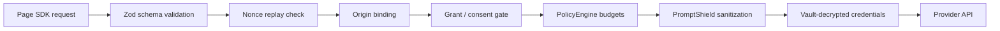
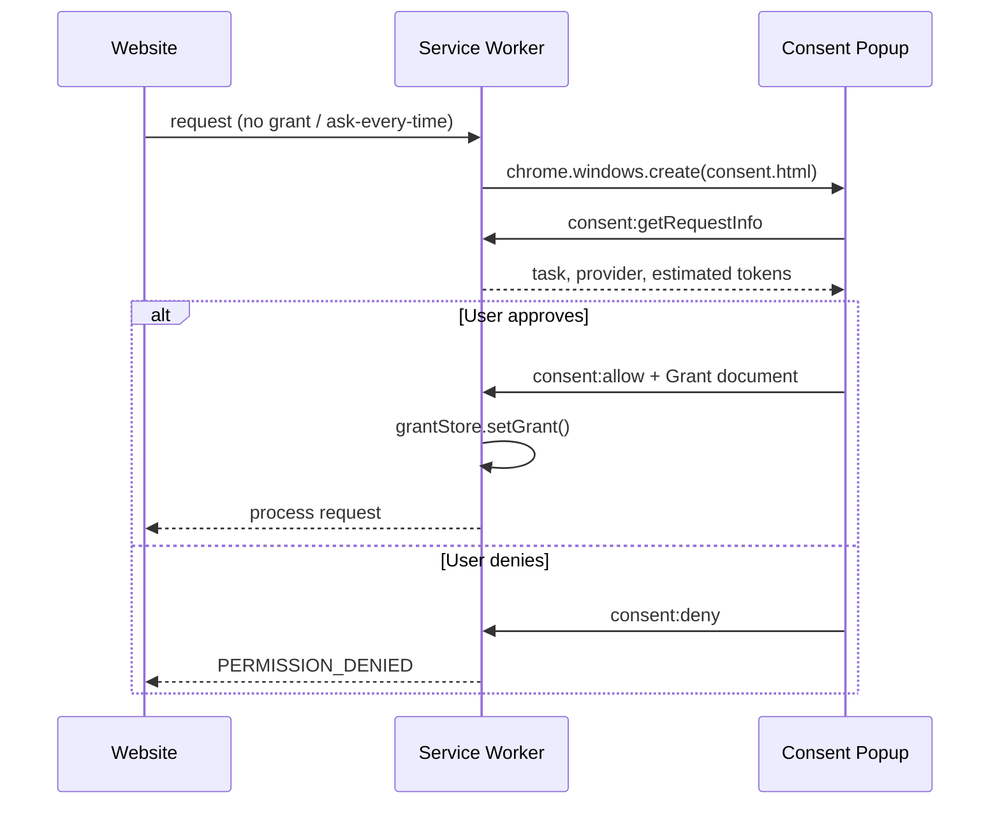

# BYOM Security Model

BYOM treats every website as untrusted. API keys never leave the extension; requests are validated at every trust boundary before reaching a provider.

## Security Layers



## Vault

The vault encrypts provider API keys at rest using the Web Crypto API.

### Key derivation

| Parameter | Value |
|-----------|-------|
| Algorithm | PBKDF2 → AES-GCM 256-bit |
| Iterations | 600,000 |
| Hash | SHA-256 |
| Salt | 16 random bytes, persisted in `local:vaultSalt` |

### Session caching

After unlock, the derived AES key is exported and stored in `chrome.storage.session` as base64. The key is **never** written to `chrome.storage.local` or disk in plaintext.

```
User passphrase → PBKDF2(salt) → AES-GCM key → session cache → encrypt/decrypt API keys
```

### Provider credential storage

Each provider config stores:

```typescript
{
  encryptedSecret: string;  // AES-GCM ciphertext (hex)
  iv: string;                 // 12-byte IV (hex)
  salt: string;               // PBKDF2 salt reference
}
```

### Lock / unlock behavior

| Action | Effect |
|--------|--------|
| **Unlock** | Derive key, cache in session, rebuild provider registry |
| **Lock** | Clear in-memory key, remove session cache, invalidate registry |
| **Vault locked during request** | Returns `VAULT_LOCKED` error to the page |

The SDK surfaces vault state via `byom.getCapabilities()` (`vaultUnlocked: boolean`) and push events (`vault-locked`).

### Passphrase rotation

`Vault.changePassphrase()` decrypts all credentials with the old key, re-encrypts with the new key, and returns the updated ciphertext array. Failure at any step aborts without partial updates.

## Nonce Replay Protection

Every bridge request includes a cryptographically random 16-byte nonce (`generateNonce()`). The same nonce cannot be reused within the replay window.

### Two-layer deduplication

| Layer | Location | Cache | TTL / size |
|-------|----------|-------|------------|
| Content script | `bridge.content.ts` | LRU set | 1,000 nonces |
| Service worker | `background.ts` `NonceCache` | Map with timestamps | 60 seconds |

A duplicate nonce returns:

```json
{
  "code": "INVALID_REQUEST",
  "message": "Duplicate request detected (replay protection)"
}
```

### Request envelope

```typescript
{
  v: 1,
  kind: 'request',
  reqId: string,
  timestamp: number,
  protocolVersion: '1.0.0',
  nonce: string,        // 16-byte random, base64
  payload: { task, request }
}
```

## Schema Validation

Zod validates at every boundary:

| Boundary | Schema |
|----------|--------|
| Content script → SW | `PortMessageSchema`, `BridgeRequestSchema` |
| Task payloads | `RequestPayloads[task]` (ask, stream, embed, …) |
| SW responses | `ResponsePayloads[task]` |
| Grant documents | `GrantSchema` |

Validation failures return `SCHEMA_VALIDATION_FAILED` with the Zod error message.

## Origin Binding

Each request carries an `origin` field set by the SDK from `window.location.origin`. The service worker compares it to `port.sender.origin`. A mismatch returns `PERMISSION_DENIED`.

Websites cannot impersonate another origin because the content script runs in the page's isolated world with the browser-enforced origin.

## Consent Flow

First-time or policy-triggered requests open a consent popup (`consent.html`).



### Consent popup shows

- Requesting origin and task type
- Suggested provider and model (from routing engine)
- Estimated token count
- Privacy mode picker
- Budget limits (daily / monthly / per-request cap)

### Auto-approve

When global routing preferences select a provider automatically (`auto` mode) and no explicit consent is required, the SW creates an auto-approved grant with `autoApprove: true`.

### Timeout

Consent windows expire after **5 minutes**. Closing the window without a decision rejects the pending request.

## Prompt Shield

`PromptShield` is middleware in OpenModelRouter that mitigates prompt injection before text reaches a provider.

### Pipeline

1. **`shield(input)`** — Always applied to message content and ask input before provider calls. Strips control characters, zero-width spaces, Unicode tag characters, homoglyphs, and long base64 blobs.
2. **`detect(input)`** — Scores suspicious patterns (ignore-previous-instructions, system prompt injection, delimiter manipulation, jailbreak phrases).
3. **`validate(input)`** — Blocks high-confidence injections; blocks medium confidence when multiple patterns match.
4. **`sanitize(input)`** — Replaces blocked phrases with `[REMOVED]`.

### Detection categories

| Category | Examples |
|----------|----------|
| Instruction override | "ignore previous instructions", "disregard all rules" |
| Role injection | `system:`, `you are now:`, `<<SYS>>`, `<\|im_start\|>` |
| Delimiter manipulation | `###`, `---`, `[INST]` |
| Encoded payloads | Base64 strings ≥ 100 characters |
| Blocked phrases | "DAN mode", "jailbreak", "developer mode" |

Confidence scoring:

| Score | Confidence | Action |
|-------|------------|--------|
| 0 | — | Pass |
| 1 | low | Pass (logged) |
| 2–4 | medium | Block if > 2 patterns |
| ≥ 5 | high | Block |

Custom patterns can be added at runtime via `addPattern()` and `addBlockedPhrase()`.

## Budget Enforcement

Spend limits are enforced authoritatively in `GrantStore` (not telemetry alone):

- Daily budget (`dailyBudgetUSD`)
- Monthly budget (`monthlyBudgetUSD`)
- Per-request token cap (`perRequestTokenCap`)
- Preflight cost estimation before provider calls

Exceeded budgets return `BUDGET_EXCEEDED`. At 80% of daily budget, a `budget-warning` event is pushed to the page.

## Error Codes (Security-Relevant)

| Code | Meaning |
|------|---------|
| `PERMISSION_DENIED` | No grant, user denied consent, or origin mismatch |
| `SITE_NOT_APPROVED` | Origin lacks an active grant |
| `TASK_NOT_ALLOWED` | Task not in grant's `allowedTasks` |
| `MODEL_NOT_ALLOWED` | Model not in grant's `modelAllowlist` |
| `VAULT_LOCKED` | Extension vault must be unlocked |
| `INVALID_REQUEST` | Replay detected or malformed request |
| `SCHEMA_VALIDATION_FAILED` | Payload failed Zod validation |
| `PROTOCOL_VERSION_MISMATCH` | SDK/extension version incompatible |

## Threat Model Notes

**In scope:**

- Stolen/replayed requests from malicious page scripts
- Prompt injection via user-controlled page content
- Budget exhaustion by approved sites
- Credential exposure if extension storage is compromised (mitigated by passphrase encryption)

**Out of scope (user responsibility):**

- Malicious browser extensions with broader permissions
- Physical access to an unlocked vault session
- Provider-side data retention policies

## Related Docs

- [Architecture](./architecture.md)
- [Policy DSL](./policy-dsl.md)
- [SDK API — error matrix](./sdk-api.md#error-matrix)
